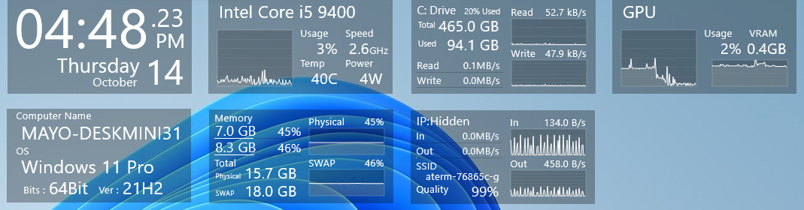
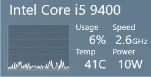
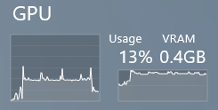
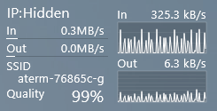
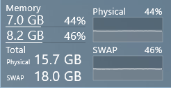
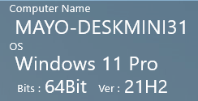

# Rainmeter-Sys-monitor
 
 This is a rainmeter skin.
[CoreTemp](https://www.alcpu.com/CoreTemp/) is required for the CPU skin to be fully functional.
 GPU skins are experimental and may not be accurate.

## How to install

+ Install Rainmeter
+ Download "Sys.Monitor.rmskin" from Release.
+ Open the downloaded folder to install the skin

## Features

CPU:
+ Displays CPU name, utilization, frequency (Speed), temperature, and power.
+ [CoreTemp](https://www.alcpu.com/CoreTemp/) is required for the CPU skin to be fully functional.

GPU:
+ This skin is experimental and may not be accurate.
+ Displays GPU utilization and VRAMShere utilization.

NetWork:
+ If you are using a LAN
    + Displays IP address, download speed and upload speed.
+ If you are using a WiFi
    + Displays IP address, download speed, upload speed, SSID and Wireless quality.
+  Click "Hidden" to display the IP address.

RAM:
+ Displays RAM total size, SWAP total size, RAM utilization and SWAP utilization

Storage:
+ Displays Disk total size, used size, read speed and write speed.

System Info:
+ Displays Computer name, OS Edition, OS Bits and OS version.

Time:
+ Displays Clock, Date, Day of Week and Month.

